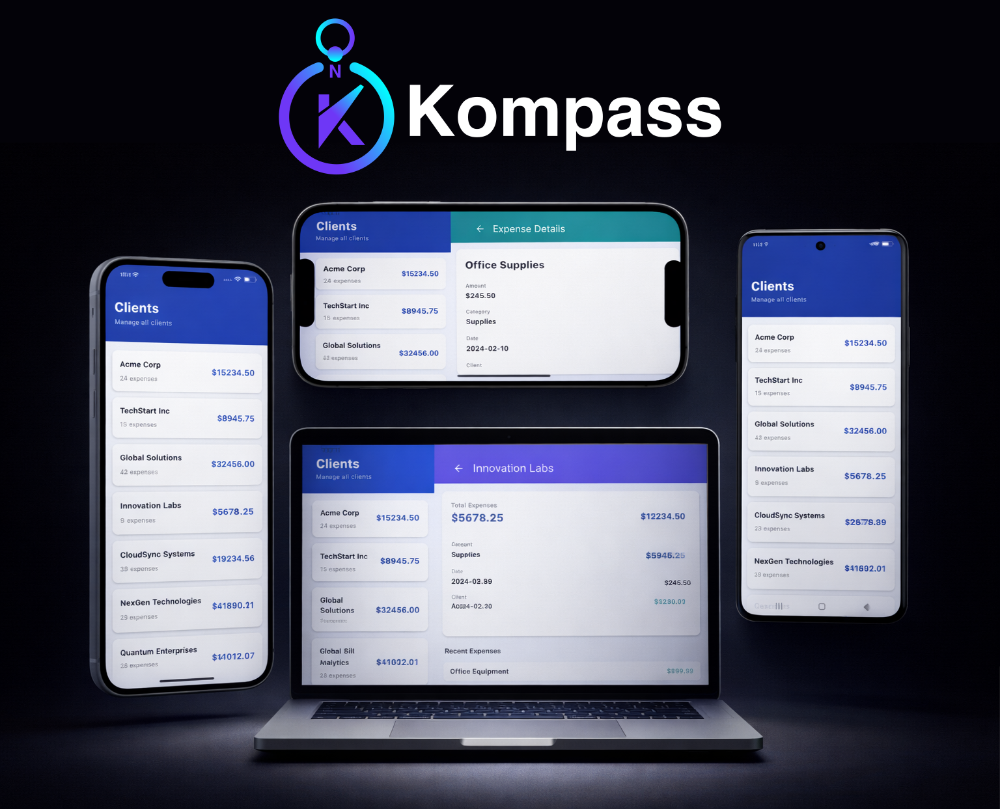

# Kompass (KMP Navigation)

[](https://central.sonatype.com/artifact/com.3xcool/kompass)
[](https://opensource.org/licenses/Apache-2.0)
[](https://kotlinlang.org)
[](https://developer.android.com/jetpack/compose)
[](https://www.android.com)

<p align="center">
  <a href="assets/KompassUsageOverviewScene.mp4">▶ Watch usage overview</a>
</p>

<p align="center">
  <a href="assets/KompassUsageOverviewScene.mp4">
    
  </a>
</p>

## About

Kompass is the next-generation navigation library designed from the ground up for Jetpack Compose. Unlike traditional navigation approaches, Kompass embraces functional programming principles and reactive architecture patterns:

- **Pure State Management** - Navigation state is immutable, serializable, and completely decoupled from UI logic. The entire navigation system is built on predictable, deterministic state transitions.
- **Reducer Pattern** - All navigation rules are side-effect free, making the navigation core trivial to test without mocking frameworks or instrumentation.
- **Multi-Graph Architecture** - Organize large applications across multiple modular navigation graphs with independent layouts and transitions.
- **Lifecycle-Aware Scopes** - Built-in scope management provides ViewModel-like instance storage with automatic cleanup and memory leak prevention.
- **Deep Linking Made Simple** - Extensible deep link handlers convert URIs into navigation commands with type-safe argument parsing.
- **Result Passing** - Deliver typed results between destinations without tight coupling or callback hell.
- **Persistent State** - Automatic serialization and restoration across configuration changes, process death, and app relaunches.
- **Customizable Layouts & Transitions** - Per-graph scene layouts support any composition pattern: single-stack, master-detail, split-screen, or custom multi-pane designs.


Perfect for applications that need robust, scalable, and testable navigation without the complexity of over-engineered frameworks.

## Contents

* [Key Features](#key-features)
* [Architecture](#architecture)
* [Installation](#installation)
* [Quick Start](#quick-start)
* [Navigation Commands](#navigation-commands)
* [Navigation Scopes](#navigation-scopes)
* [Navigation Results](#navigation-results)
* [Custom Layouts & Transitions](#custom-layouts--transitions)
* [Deep Linking](#deep-linking)
* [State Serialization](#state-serialization)
* [Testing](#testing)
* [Configuration & Customization](#configuration--customization)
* [Performance Considerations](#performance-considerations)
* [Thread Safety](#thread-safety)
* [Contributing](#contributing)
* [Resources](#resources)

## Key Features

- **Pure State Management** - Navigation state is immutable and serializable, separate from UI logic
- **Testable Reducer Pattern** - All navigation rules are deterministic and side-effect free
- **Pluggable Layouts & Transitions** - Customize screen transitions and multi-pane layouts per graph
- **Multi-Graph Support** - Organize destinations across multiple navigation graphs
- **Navigation Scopes** - Lifecycle-aware instance management (ViewModel-like) with automatic cleanup
- **Deep Linking** - Built-in deep link support with extensible handlers
- **Result Passing** - Deliver navigation results between destinations
- **Persistent State** - Automatic serialization and restoration across configuration changes

## Architecture

Kompass follows a clean separation of concerns:

```
Navigation Logic
    ↓
NavigationHandler (pure reducer: State + Command → State)
    ↓
NavigationState (immutable back stack)
    ↓
NavController (facade & effects)
    ↓
KompassNavigationHost (renders via NavigationGraph)
    ↓
Screen Content
```

### Core Components

- **NavigationState** - Immutable representation of the back stack
- **NavigationHandler** - Pure reducer applying navigation commands
- **NavController** - Public API for performing navigation
- **KompassNavigationHost** - Root composable orchestrating rendering
- **NavigationGraph** - Maps destinations to UI content
- **NavigationScopes** - Thread-safe lifecycle-aware instance storage
- **BackStackEntry** - Represents a single stack entry with destination, args, and scope

## Installation

Add to your `build.gradle.kts`:

```kotlin
repositories {
    mavenCentral()
}

dependencies {
    implementation("com.3xcool:kompass:1.0.0")
    implementation("org.jetbrains.kotlinx:kotlinx-collections-immutable:0.3.7")
    implementation("org.jetbrains.kotlinx:kotlinx-serialization-json:1.6.2")
}
```

## Quick Start

### 1. Define Destinations

```kotlin
sealed interface MainDestination : Destination {
    data object Home : MainDestination {
        override val id: String = "home"
    }
    data object Profile : MainDestination {
        override val id: String = "profile"
    }
    data object Settings : MainDestination {
        override val id: String = "settings"
    }
}
```

### 2. Create a Navigation Graph

```kotlin
class MainNavigationGraph : NavigationGraph {
    override fun canResolveDestination(destinationId: String): Boolean =
        destinationId in setOf("home", "profile", "settings")

    override fun resolveDestination(
        destinationId: String,
        args: String?
    ): Destination = when (destinationId) {
        "home" -> MainDestination.Home
        "profile" -> MainDestination.Profile
        "settings" -> MainDestination.Settings
        else -> error("Unknown destination: $destinationId")
    }

    @Composable
    override fun Content(
        entry: BackStackEntry,
        destination: Destination,
        navController: NavController
    ) {
        when (destination) {
            is MainDestination.Home -> HomeScreen(navController)
            is MainDestination.Profile -> ProfileScreen(navController)
            is MainDestination.Settings -> SettingsScreen(navController)
        }
    }
}
```

### 3. Setup Navigation Host

```kotlin
@Composable
fun AppNavigation() {
    val navController = rememberNavController(
        startDestination = MainDestination.Home
    )

    KompassNavigationHost(
        navController = navController,
        graphs = persistentListOf(MainNavigationGraph())
    )
}
```

### 4. Navigate from Screens

```kotlin
@Composable
fun HomeScreen(navController: NavController) {
    Button(
        onClick = {
            navController.navigate(
                entry = BackStackEntry(
                    destinationId = "profile",
                    scopeId = newScope()
                )
            )
        }
    ) {
        Text("Go to Profile")
    }
}
```

## Navigation Commands

### Navigate

Push a new destination onto the back stack:

```kotlin
navController.navigate(
    entry = BackStackEntry(
        destinationId = "profile",
        args = """{"userId":"123"}""",
        scopeId = newScope()
    ),
    clearBackStack = false,        // Clear entire stack
    popUpTo = "home",              // Pop up to destination
    popUpToInclusive = false,      // Include the destination in pop
    reuseIfExists = false          // Reuse existing entry
)
```

### Pop

Remove one or more entries from the back stack:

```kotlin
// Pop single entry
navController.pop()

// Pop with result
navController.pop(result = ProfileResult(userId = "123"))

// Pop multiple entries
navController.pop(count = 2)

// Pop until destination
navController.pop(popUntil = "home")
```

### Replace Root

Replace the entire back stack with a single entry:

```kotlin
navController.replaceRoot(
    entry = BackStackEntry(
        destinationId = "home",
        scopeId = newScope()
    )
)
```

## Navigation Scopes

Navigation Scopes provide lifecycle-aware instance storage similar to ViewModels:

```kotlin
@Composable
fun ProfileScreen(navController: NavController, entry: BackStackEntry) {
    val viewModel = rememberScoped<ProfileViewModel>(
        scopeId = entry.scopeId,
        factory = { ProfileViewModel() },
        onCleared = { it.close() }
    )

    // ViewModel survives recomposition but is cleared when entry is popped
    LaunchedEffect(Unit) {
        viewModel.loadProfile()
    }
}
```

### Scope Types

**Default Scope** - Shared state across multiple navigations to same destination:
```kotlin
val entry = BackStackEntry(
    destinationId = "profile",
    scopeId = destination.defaultScope()  // "entry:profile"
)
```

**Unique Scope** - Isolated state for each navigation:
```kotlin
val entry = BackStackEntry(
    destinationId = "profile",
    scopeId = newScope()  // "entry:{randomUUID}"
)
```

## Navigation Results

Pass data between destinations using results:

```kotlin
// Send result when popping
navController.pop(
    result = ProfileResult(userId = "123"),
    count = 1
)

// Receive result in destination
@Composable
fun HomeScreen(navController: NavController, entry: BackStackEntry) {
    val result = entry.results["profile_result"] as? ProfileResult

    LaunchedEffect(result) {
        if (result != null) {
            // Handle result
        }
    }
}
```

## Custom Layouts & Transitions

Customize screen transitions and multi-pane layouts:

```kotlin
class MainNavigationGraph : NavigationGraph {
    override val sceneLayout: SceneLayout = object : SceneLayout {
        @Composable
        override fun Render(
            backStack: ImmutableList<BackStackEntry>,
            resolve: (BackStackEntry) -> Pair<NavigationGraph, Destination>,
            navController: NavController,
            direction: NavDirection
        ) {
            AnimatedContent(
                targetState = backStack.last(),
                transitionSpec = {
                    slideInHorizontally() togetherWith slideOutHorizontally()
                }
            ) { entry ->
                val (graph, destination) = resolve(entry)
                graph.Content(entry, destination, navController)
            }
        }
    }

    override val sceneTransition: SceneTransition? = null
}
```

### Multi-Pane Layouts

For tablet layouts with master-detail patterns:

```kotlin
override val sceneLayout: SceneLayout = object : SceneLayout {
    @Composable
    override fun Render(
        backStack: ImmutableList<BackStackEntry>,
        resolve: (BackStackEntry) -> Pair<NavigationGraph, Destination>,
        navController: NavController,
        direction: NavDirection
    ) {
        Row {
            // Master pane (static)
            Box(modifier = Modifier.weight(1f)) {
                val masterEntry = backStack.first()
                val (graph, destination) = resolve(masterEntry)
                graph.Content(masterEntry, destination, navController)
            }

            // Detail pane (animated)
            AnimatedContent(
                targetState = backStack.last(),
                modifier = Modifier.weight(1f),
                label = "DetailPane"
            ) { entry ->
                val (graph, destination) = resolve(entry)
                graph.Content(entry, destination, navController)
            }
        }
    }
}
```

## Deep Linking

Resolve deep link URIs to navigation commands:

```kotlin
interface DeepLinkHandler {
    fun canHandle(uri: String): Boolean
    fun resolve(uri: String): List<NavigationCommand>?
}

class ProfileDeepLinkHandler : DeepLinkHandler {
    override fun canHandle(uri: String): Boolean = uri.startsWith("app://profile/")

    override fun resolve(uri: String): List<NavigationCommand>? {
        val userId = uri.removePrefix("app://profile/")
        return listOf(
            NavigationCommand.Navigate(
                entry = BackStackEntry(
                    destinationId = "profile",
                    args = """{"userId":"$userId"}""",
                    scopeId = newScope()
                )
            )
        )
    }
}

// Apply deep link
val success = navController.applyDeepLink("app://profile/user123")
```

## State Serialization

Navigation state is automatically serialized and restored:

```kotlin
@Composable
fun rememberNavController(
    initialState: NavigationState,
    serializersModule: SerializersModule = SerializersModule {},
    deepLinkUri: String? = null,
    deepLinkHandlers: ImmutableList<DeepLinkHandler> = persistentListOf()
): NavController {
    // State is saved via rememberSaveable and restored on configuration changes
}
```

## Testing

Since navigation logic is pure and deterministic, testing is straightforward:

```kotlin
@Test
fun testNavigateCommand() {
    val handler = NavigationHandler()
    val initialState = defaultNavigationState(
        BackStackEntry(
            destinationId = "home",
            scopeId = NavigationScopeId("home")
        )
    )

    val command = NavigationCommand.Navigate(
        entry = BackStackEntry(
            destinationId = "profile",
            scopeId = newScope()
        )
    )

    val newState = handler.reduce(initialState, command)

    assertEquals(2, newState.backStack.size)
    assertEquals("profile", newState.backStack.last().destinationId)
}

@Test
fun testPopCommand() {
    val handler = NavigationHandler()
    val state = NavigationState(
        backStack = persistentListOf(
            BackStackEntry("home", scopeId = NavigationScopeId("home")),
            BackStackEntry("profile", scopeId = newScope())
        ).toImmutableList()
    )

    val newState = handler.reduce(state, NavigationCommand.Pop())

    assertEquals(1, newState.backStack.size)
    assertEquals("home", newState.backStack.last().destinationId)
}
```

## Configuration & Customization

### Custom Serialization

Register custom serializers for destination arguments:

```kotlin
val serializersModule = SerializersModule {
    polymorphic(NavigationResult::class) {
        subclass(ProfileResult::class)
        subclass(SettingsResult::class)
    }
}

val navController = rememberNavController(
    startDestination = MainDestination.Home,
    serializersModule = serializersModule
)
```

### Custom Navigation Scopes

Extend `NavigationScope` for specialized instance management:

```kotlin
class CustomNavigationScope(id: NavigationScopeId) : NavigationScope(id) {
    // Add custom behavior
}
```

## Performance Considerations

- **Immutable Collections** - Uses `kotlinx-collections-immutable` for efficient structural sharing
- **Lazy Graph Resolution** - Destinations are only resolved when rendered
- **Efficient Recomposition** - State changes only trigger recomposition of affected content
- **Scope Cleanup** - Scopes are automatically cleaned when entries are removed, preventing memory leaks

## Thread Safety

- Navigation state is immutable and thread-safe
- `NavigationScopes` uses `@Volatile` and copy-on-write for lock-free thread safety
- Safe to call from Composable and background threads

## Contributing

Contributions are welcome! Please ensure:
- All navigation logic remains pure and testable
- New features maintain backward compatibility
- Comprehensive tests accompany changes
- Code follows existing style and patterns

## License

This project is licensed under the Apache License 2.0 - see the [LICENSE](LICENSE) file for details.

## Resources

- [Compose Documentation](https://developer.android.com/jetpack/compose)
- [Kotlinx Serialization](https://github.com/Kotlin/kotlinx.serialization)
- [Kotlinx Collections Immutable](https://github.com/Kotlin/kotlinx.collections.immutable)
- [GitHub Repository](https://github.com/3xcool/kompass)
